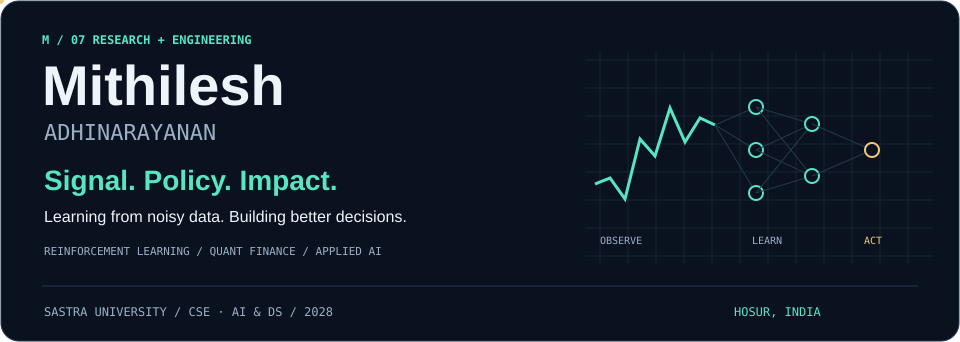
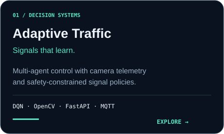
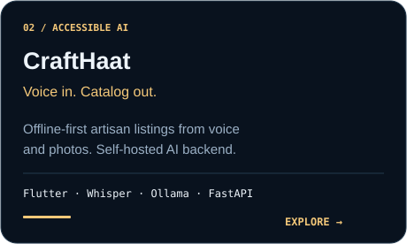
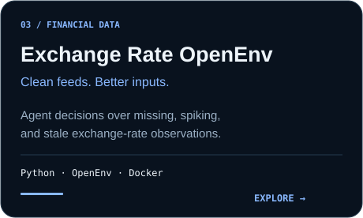
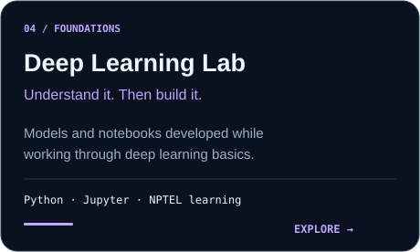
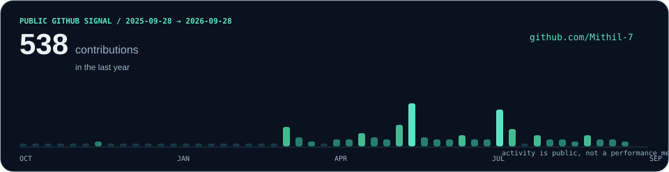

**AI researcher · Quant enthusiast · Builder**

[Portfolio](https://mithil-7.github.io/) &nbsp; / &nbsp; [LinkedIn](https://www.linkedin.com/in/mithilesh-a-07486935b/) &nbsp; / &nbsp; [Email](mailto:mithilcuber@gmail.com) &nbsp; / &nbsp; [Freelancer](https://www.freelancer.in/u/Mithil7a)

SASTRA Deemed University · B.Tech CSE (AI & DS), 2024–2028 · Hosur, India

---

## 01 / The questions I build around

**How do you turn noisy observations into better decisions?**

That question connects most of my work: exchange-rate forecasting, reinforcement-learning agents for traffic signals, and machine learning for network security. I'm **Mithilesh**, a Computer Science undergraduate at **SASTRA Deemed University**, exploring the intersection of **deep learning, reinforcement learning, and quantitative finance**.

I also build the systems around the models: data pipelines, APIs, dashboards, and applications that make an idea usable beyond a notebook.

| Research lens | Engineering lens | Mathematical lens |
| :--- | :--- | :--- |
| Learn from sequential data and feedback | Connect models to useful applications | Understand uncertainty, signals, and risk |
| DNN–RL forecasting · APT detection | Multi-agent traffic control · Voice-first AI | Alpha research · Probability · Time series |

## 02 / Selected builds

  
  

  
  

| Project | What makes it interesting |
| :--- | :--- |
| [**Adaptive Traffic Management**](https://github.com/Mithil-7/RL-Based-Traffic-Management-System) | SIH 2025 idea developed into a multi-agent platform: DQN signal control, emergency preemption, routing, MQTT telemetry, and a dashboard. A hard safety layer constrains learned policies. Simulation and hardware integration points are documented separately. |
| [**CraftHaat**](https://github.com/Mithil-7/CraaftHaat) | Voice + photo → AI-generated product catalog. Offline capture with a self-hosted speech/image/LLM backend and ONDC payload preparation. A prototype: live ONDC publishing and production authentication remain open work. |
| [**Exchange Rate OpenEnv**](https://github.com/Mithil-7/Open_Env-Exchange_rate) | An environment where agents choose whether to accept, replace, or drop currency-feed ticks under missing data, price spikes, and latency. **Data remediation**, distinct from my forecasting research. |
| [**Deep Learning Lab**](https://github.com/Mithil-7/DL--nptel-learning-projects) | A collection of deep learning models built while working through the fundamentals. |

<b>More from the workbench</b>

- [Amazon ML Challenge](https://github.com/Mithil-7/Amazon_ML-challenge) — challenge work and notebooks.
- [Data Science Projects](https://github.com/Mithil-7/Data-Science-projects) — a collection of my projects.
- [PyMC / GSoC 2026 Preparation](https://github.com/Mithil-7/GSoC-2026-PyMC-Preparation) — preparation repository; not a claim of program selection.
- [Prep](https://github.com/Mithil-7/Prep) — coding, DSA, competitive programming, and quantitative-finance preparation.
- [Portfolio source](https://github.com/Mithil-7/Mithil-7.github.io) — the website behind my work.

My GitHub also includes forks for learning and exploration; those are not presented here as original projects.

**[Explore all repositories →](https://github.com/Mithil-7?tab=repositories)**

## 03 / Research notebook

### Learning from markets
**DNN–RL exchange-rate forecasting · March 2026–present**

Exploring hybrid deep neural networks and **PPO policy-gradient reinforcement learning** for financial time-series forecasting, incorporating **crude oil, gold futures, and NIFTY 50** as macroeconomic signals.

`Deep learning` · `PPO` · `Multivariate time series` · `Quantitative finance`

**Publication status:** submitted to IEEE and under peer review; this is not a published-paper claim.

### Learning from threats
**Advanced Persistent Threat detection · February 2026–present**

Investigating machine learning and anomaly detection for identifying persistent, sophisticated threats in network activity.

`Anomaly detection` · `Network security` · `Machine learning`

## 04 / Tools behind the work

  

| Area | Technologies & concepts |
| :--- | :--- |
| **Learning & decision-making** | PPO · DQN · Multi-agent RL · Policy gradients · Transfer learning · TensorFlow · PyTorch |
| **Language & generative AI** | Transformers · BERT / GPT · Hugging Face · RAG · Prompt engineering · Whisper · Ollama |
| **Vision** | OpenCV · YOLO · Object detection · Image segmentation |
| **Data & mathematics** | NumPy · Pandas · Matplotlib · Seaborn · Probability · Statistical modeling |
| **Quantitative finance** | Alpha research · Backtesting · Algorithmic trading · Risk analysis · Portfolio optimization |
| **Applications & infrastructure** | FastAPI · Django · Flask · React · Flutter · REST / WebSocket APIs · MongoDB · PostgreSQL · Redis · MQTT · Docker |
| **Languages & environment** | Python · C++ · C · Java · JavaScript · SQL · Git · Linux · Jupyter · Raspberry Pi |

## 05 / Experience & milestones

**WorldQuant · BRAIN Research Consultant**  
April 2026–present  
Developing and backtesting quantitative alphas on the BRAIN platform using probability and statistical modeling; reached Gold Genius level.

**XYlofy AI · AI & Data Science Intern**  
June–July 2026  
Built machine-learning architectures and Python data pipelines, integrating REST APIs and model backends for automation projects.

**Freelance AI/ML Developer**  
2026–present  
Building custom AI/ML solutions and full-stack applications, from data pipelines and training workflows to APIs.

**SASTRA Deemed University · Student Researcher**  
February 2026–present  
Working on exchange-rate forecasting and APT detection research.

| Milestone | Detail |
| :--- | :--- |
| **CMI STEMS 2025** | Top 30 in India · Chennai Mathematical Institute |
| **WorldQuant BRAIN** | Gold Genius level · quantitative alpha research |
| **Smart India Hackathon 2025** | RL-based intelligent traffic management · Odisha |
| **Mathematics Olympiad** | IOQM qualifier · Merit certificate |
| **Yale / Coursera** | Financial Markets certification · Completed |
| **NPTEL SWAYAM** | Deep Learning coursework · 2026 |
| **Harvard CS50W** | Web Programming with Python and JavaScript · In progress |

## 06 / The contribution signal

  

Generated from my public GitHub contribution calendar. This is a dated snapshot, not a live feed or performance metric. Click either chart for the latest GitHub activity. Refresh instructions are in <a href="SETUP.md">SETUP.md</a>.

---

### Good questions deserve working prototypes.

Open to **research collaborations**, **internships**, and **freelance AI/ML work**—especially where learning systems meet financial data or real-world decisions.

**[Let's talk →](mailto:mithilcuber@gmail.com)**

[Portfolio](https://mithil-7.github.io/) · [LinkedIn](https://www.linkedin.com/in/mithilesh-a-07486935b/) · [GitHub](https://github.com/Mithil-7) · [Stack Exchange](https://stackexchange.com/users/36784600/mithil-a) · [Freelancer](https://www.freelancer.in/u/Mithil7a)

Mithilesh Adhinarayanan · Signal → Policy → Impact

